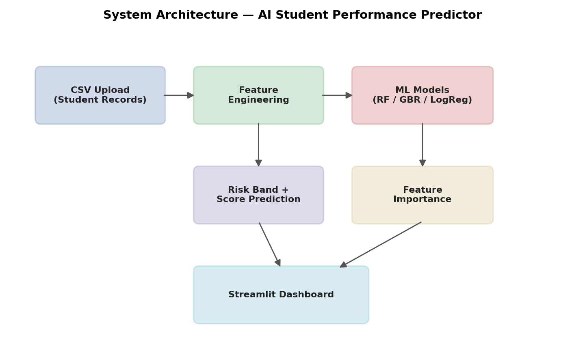
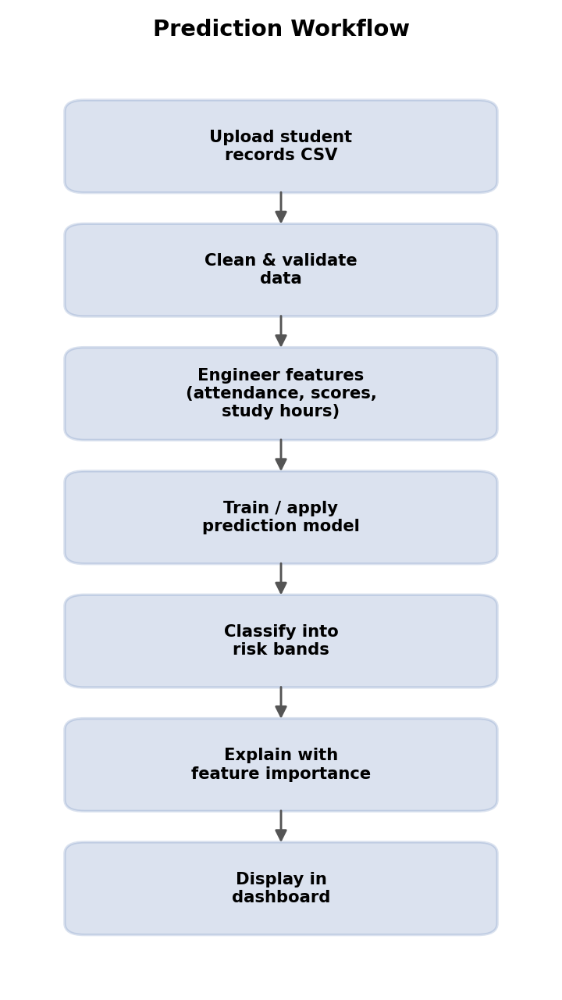
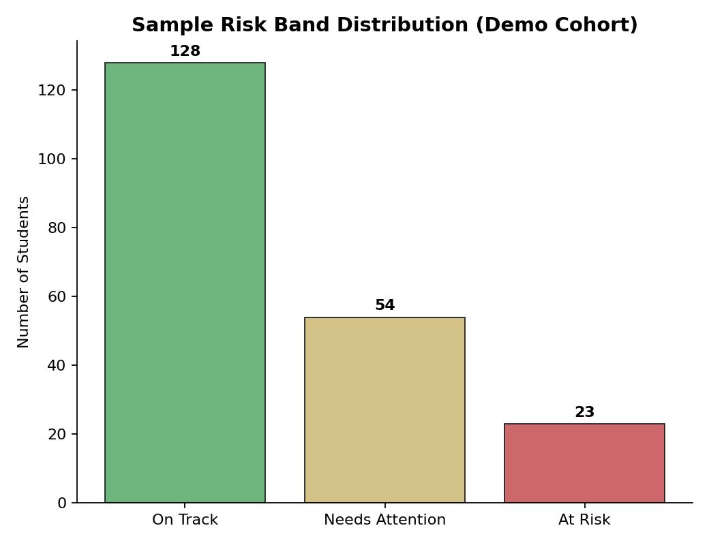
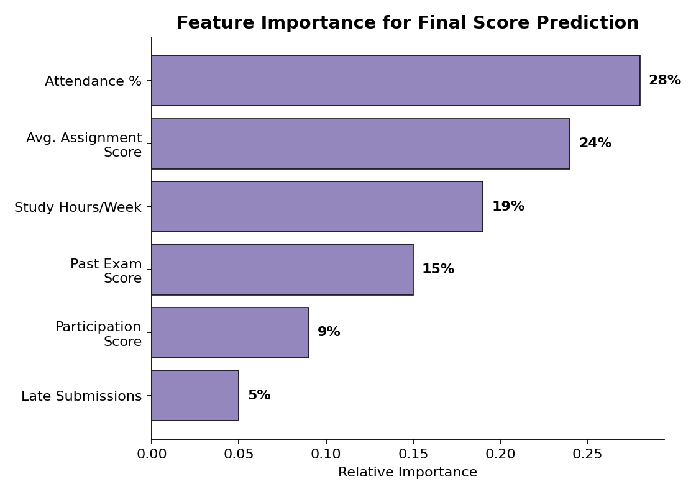
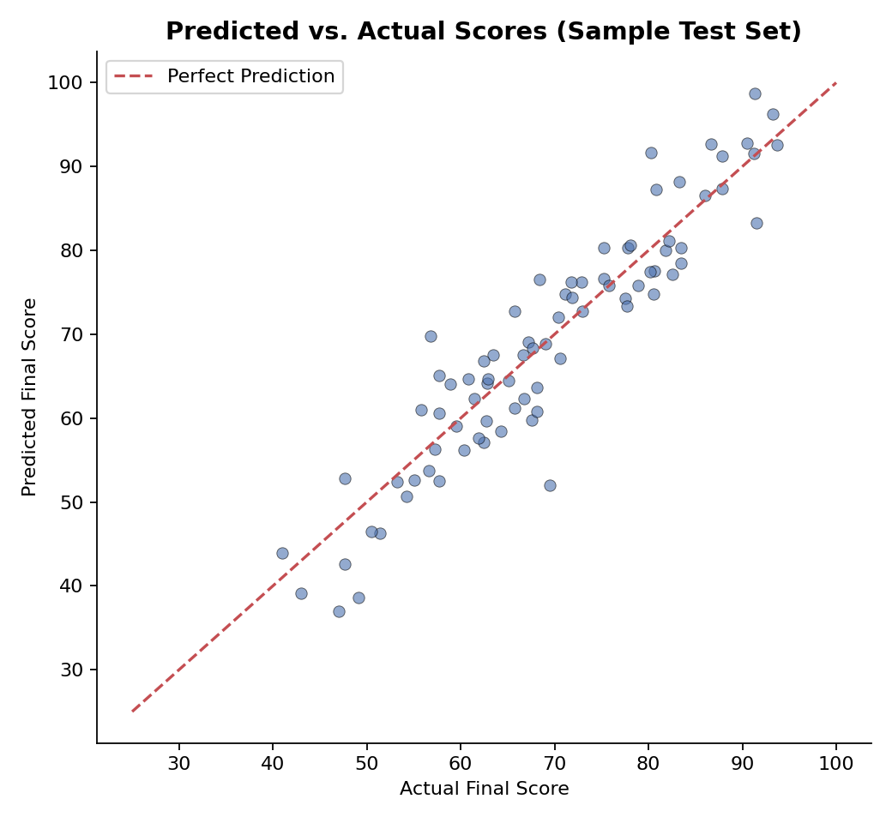

# AI Student Performance Predictor
Final project for the Building AI course

## Summary

AI Sales & Revenue Predictor is a lightweight, browser-based tool that turns a small business's raw sales CSV into a clear revenue forecast. A user uploads their own sales export, and the app aggregates it into monthly revenue, fits a trend model, forecasts the next few months overall and by product/region, and flags any unusually large or small orders worth a second look — all without needing a data team or any special software beyond a web browser.

## Background

Small business owners and shop managers often have a good gut feel for "business is up" or "business is slow," but rarely have an easy way to turn their raw sales exports into a forward-looking number they can plan around. Spreadsheet-based trend lines are fiddly to maintain and don't scale well across multiple products or regions, and full BI/forecasting platforms are usually overkill — expensive, slow to set up, and built for teams with a dedicated analyst rather than a solo owner who just wants next month's revenue estimate after closing out this month's books. This project was built as a student project to explore how far a simple, well-scoped combination of classical ML techniques (moving averages, linear regression, isolation forest) can go in giving a non-technical user a personal, trustworthy forecast from nothing but their own transaction history — used occasionally, right after exporting a statement, rather than as an always-on system.

## Data sources and AI methods

The system doesn't use any external dataset by default — it works directly on the user's own uploaded student records CSV (marks, attendance, assignment scores, etc.), so predictions are trained on the institution's or teacher's own data rather than a generic public dataset. A small bundled sample dataset (based on the commonly-used UCI "Student Performance" dataset) is included only for demo/cold-start purposes, so the app has something to show before a real file is uploaded.

| Method | What it's used for |
|---|---|
| Feature engineering (attendance %, average assignment score, study hours, past exam scores) | Turning raw records into predictive inputs |
| Random Forest / Gradient Boosting Regressor (with Linear Regression as a fallback for very small datasets) | Predicting a student's final exam score or GPA |
| Logistic Regression / Random Forest Classifier | Classifying students into risk bands (e.g. "At Risk," "Needs Attention," "On Track") |
| Feature importance (from the trained tree model) | Explaining *why* a student was flagged — e.g. "low attendance" vs "declining assignment scores" |

## Challenges

1. The model is only as good as the historical data it's trained on — a school with a small or unrepresentative dataset will get noisy, low-confidence predictions, especially for outlier students.
2. Correlation isn't causation: the model can say attendance and final score are linked, but it can't explain the underlying reason (family issues, learning difficulties, etc.), so predictions should support a teacher's judgment, not replace it.
3. The risk-band classifier assumes the patterns that predicted risk in the past will hold in the future, which breaks down around one-off disruptions (illness, exam format changes, a new curriculum).
4. The system only works with structured, numeric/categorical data in CSV form — it can't incorporate qualitative signals like teacher notes, behavioral incidents, or extracurricular context.
5. Predicting and labeling students carries real ethical weight — a "high risk" label can become a self-fulfilling narrative if mishandled, so a production version would need careful framing, teacher-in-the-loop review, and safeguards against misuse, none of which this student project implements.

## What next?

1. Add support for qualitative inputs (teacher remarks, behavioral flags) via simple sentiment/keyword tagging, not just numeric scores.
2. Expand training data across multiple schools/cohorts (anonymized) to improve generalization beyond a single institution's patterns.
3. Move from static snapshot predictions to a time-series view per student, tracking trajectory over a term rather than a single score.
4. Add intervention tracking — let teachers log what support was given to a flagged student and correlate it with outcome changes over time.
5. To get there, I'd benefit from more hands-on practice with model explainability (e.g. SHAP) so predictions are easier for non-technical teachers to trust, and feedback from real (anonymized) school datasets to stress-test the pipeline.

## Acknowledgments

1. Built using open-source tools: Django, Django REST Framework, MongoDB / mongoengine, Streamlit, scikit-learn, pandas, and Plotly.
2. Sample/demo dataset structure inspired by the publicly available UCI Student Performance dataset; no proprietary or real student data is included.
